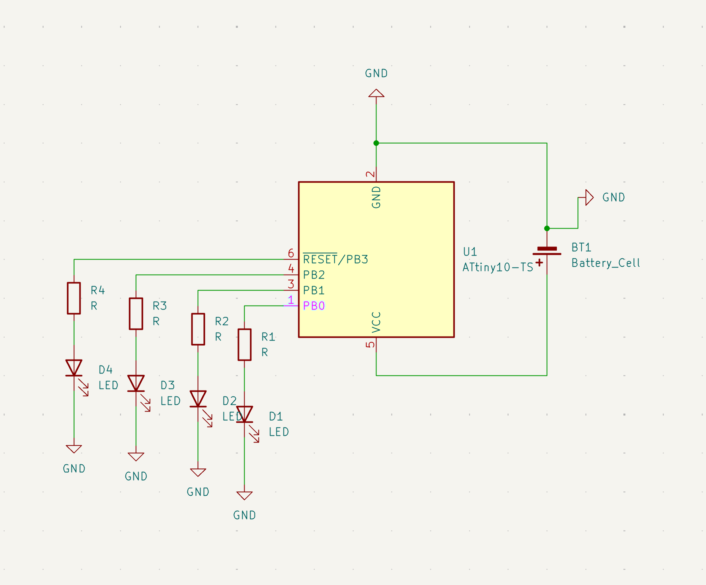

# nyancat PCB ₍^. .^₎⟆
made with KiCad; flat components for more lightweight use (as keychain or for general decoration!)

  

# design
- ordering with white solder mask + black silkscreen
- shiny tail design, made with decorative copper tracks + lines stacked on top
- colorful lights running a chasing pattern (powered by ATtiny10 microcontroller)

# preview

  

&nbsp

  

# schematics

  

# pcb editor

  

